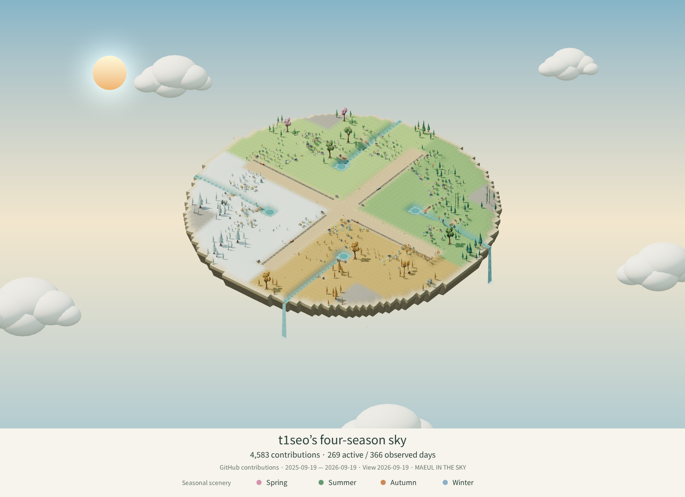

# Archived sky world · 2026-09-19

This four-season 3D island is a frozen experiment. My active profile now uses the animated SVG village.

[Open the archived 3D island](https://t1seo.github.io/maeul-in-the-sky/world/?world=https%3A%2F%2Fraw.githubusercontent.com%2Ft1seo%2Ft1seo%2Fmain%2Farchive%2Fsky-world-2026-09-19%2Fmaeul-in-the-sky-world.json&view=three) · [Return to my profile](../../README.md)

The original world, day/night PNGs, source snapshot, profile README and capture workflow are preserved here without regeneration. The workflow is a reference file outside GitHub Actions' active workflow directory. SHA-256 hashes and original commit references are recorded in [manifest.json](./manifest.json).

Root world/PNG files remain frozen compatibility copies for previously shared URLs. Routine profile updates generate only the day/night SVGs and contribution snapshot. The PNG above is a still image; motion is available only in the archived interactive view.
